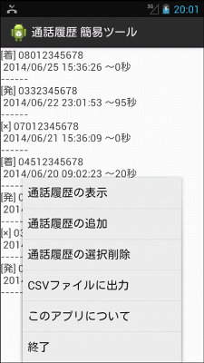
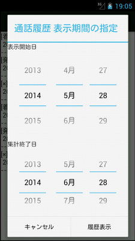
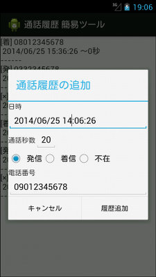
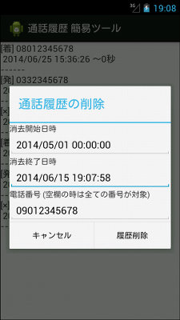

## Android 通話履歴の表示・追加・削除プログラム Android  Call Log read/add/delete<!-- omit in toc -->

[Home](https://oasis3855.github.io/webpage/) > [Software](https://oasis3855.github.io/webpage/software/index.html) > [Software Download](https://oasis3855.github.io/webpage/software/software-download.html) > [android-phonetools](../README.md) > ***call-log-edit*** (this page)

 
 

Last Updated : Jun. 2014

- [ソフトウエアのダウンロード](#ソフトウエアのダウンロード)
- [概要](#概要)
- [動作確認済み](#動作確認済み)
- [バージョンアップ履歴](#バージョンアップ履歴)
- [ライセンス](#ライセンス)

 
 

## ソフトウエアのダウンロード

-  [このGitHubリポジトリを参照する（ソースコード）](./)
-  [このGitHubリポジトリを参照する（apkファイル）](./apk/)
-  [Googleドライブからapkファイルやソースコードの圧縮パッケージをダウンロードする](https://drive.google.com/folderview?id=0B7BSijZJ2TAHcWFSNGZnbndrcEU&usp=sharing)

## 概要

Androidの通話履歴の検索・表示、新規追加・削除を行うプログラム

履歴表示画面と、メインメニュー 

履歴表示のクエリ条件設定ダイアログ

履歴追加の項目設定ダイアログ 

履歴削除のクエリ条件設定ダイアログ 

## 動作確認済み

- Android 4.1
- Android 2.3.3 

## バージョンアップ履歴

- Version 1.0 (2014/06/28)

  - 当初 

- Version 1.1 (2014/06/29)

  - API 10(Android 2.3.3)対応, CSVエクスポート 

## ライセンス

このスクリプトは [GNU General Public License v3ライセンスで公開する](https://gpl.mhatta.org/gpl.ja.html) フリーソフトウエア

