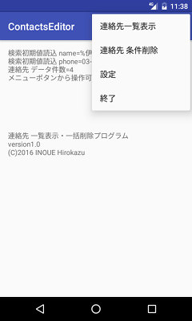
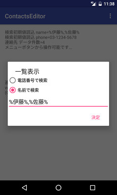
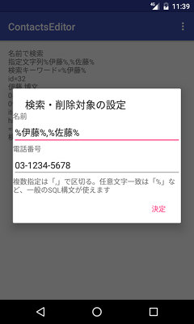
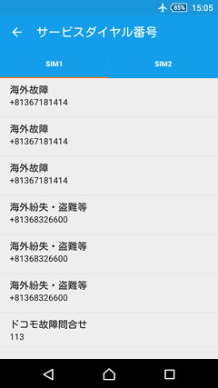

## Android 連絡先一覧表示・一括削除プログラム Android Contacts Editor<!-- omit in toc -->

[Home](https://oasis3855.github.io/webpage/) > [Software](https://oasis3855.github.io/webpage/software/index.html) > [Software Download](https://oasis3855.github.io/webpage/software/software-download.html) > [android-phonetools](../) > ***contacts-editor*** (this page)

 
 

Last Updated : Dec. 2016

- [ソフトウエアのダウンロード](#ソフトウエアのダウンロード)
- [概要](#概要)
- [動作確認済みAndroidバージョン](#動作確認済みandroidバージョン)
- [開発の背景](#開発の背景)
- [バージョンアップ情報](#バージョンアップ情報)
- [ライセンス](#ライセンス)
- [ソースコードの概略説明](#ソースコードの概略説明)

 
 

## ソフトウエアのダウンロード

- [このGitHubリポジトリを参照する（ソースコード）](./)
- [このGitHubリポジトリを参照する（apkファイル）](./apk/)
- [Googleドライブからapkファイルやソースコードの圧縮パッケージをダウンロードする](https://drive.google.com/drive/folders/0B7BSijZJ2TAHZVp6NldjLUJPXzQ?usp=sharing)

## 概要

Androidの標準機能「連絡先（Contacts）」のデータを、名前・電話番号でフィルタリングして一覧表示・一括削除するプログラム

起動直後の画面、ポップアップ・メニューを表示したところ 

一覧表示の検索条件入力用アクション・ダイアログ表示 

連絡先はSQLiteで内部処理されているため、検索条件もSQLite準拠のSQL文が利用可能。つまり、「%」文字は0文字以上の任意の文字に一致し、「_」は任意の1文字に一致する。

「,」（コンマ）で区切って、複数の検索を実行できるようにしている。

検索文字はプレースホルダで渡しているが、どこまで不正な構文を除去してくれるかわからないため、入力文字列がSQL文法の一部にならないよう注意して使うほうがよい。 

設定用アクション・ダイアログ表示 （検索条件の名前・電話番号をプロファイルに記憶させておくための設定）

## 動作確認済みAndroidバージョン

SDK API16で構築したため、Android 4.1 以降のみで実行可能

- Android 4.1.2
- Android 5.0
- Android 6.0 

## 開発の背景

自宅が「ほぼ電波圏外」のため、「弱すぎる電波」をサーチするスマートフォンのバッテリー消費が猛烈に早い。どうせ使えないならスマートフォンの寿命を伸ばすためにも、家に帰るとスマートフォンの電源をOFF。翌朝ONを繰り返している。

再起動毎に、NTTドコモのSIMカードがサービスダイヤル番号を「新たに」追加するので、連絡先が重複したサービスダイヤル番号で膨れ上がってしまう。これを一括削除するために作成したソフトウエア。 

## バージョンアップ情報

- Version 1.0 (2016/12/23)

  - 当初 

## ライセンス

このスクリプトは [GNU General Public License v3ライセンスで公開する](https://gpl.mhatta.org/gpl.ja.html) フリーソフトウエア

 
 

## ソースコードの概略説明

- [ソースコードの概略説明はこちらのページ](README-tech.md)

